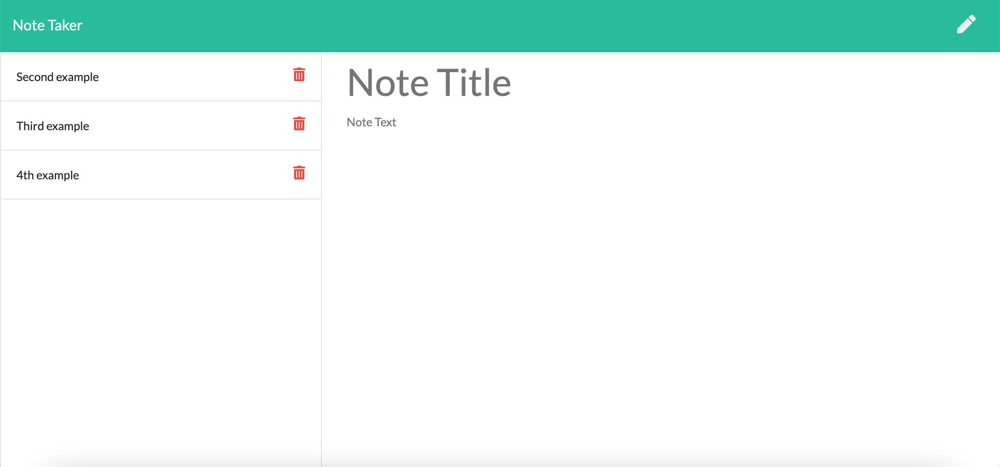

# Note_Taker

## Table of Contents

* [About-project](#Description)
* [Video](#Video)
* [Picture](#Picture)
* [Installation](#Installation)
* [License](#License)
* [Contributor](#Contributor)
* [LinkedIn-profile](#LinkedIn-profile)
* [GitHub-profile](#GitHub-profile)
* [Website](#Website)

### About the project:
The Note_Taker Application creates and stores user's notes. The user simply writes a title and the notes and hits the save icon. The note will then render on the notes page. Notes can be deleted at anytime. Application is deployed to heroku. Front-end is connected to and Express.js back-end.

### Video:
[![Press click to watch the video]](https://drive.google.com/file/d/1hxI5b3uLeyAvTdCvhkLpGskZWzU4EXpD/view)

### Picture:
 

### Instalation:
To install necessary dependencies (uniqid, path, fs, express), run the following command:  
`
npm i
` 
or 
open [Deployed Application](https://sleepy-wildwood-04274.herokuapp.com/)

### License:
MIT

### Contributor:
Sandu Corobcenco

### LinkedIn profile:
https://www.linkedin.com/in/sandu-corobcenco-527131165/

### GitHub profile:
https://github.com/SanduCorobcenco

### Website:
[WEBSITE](https://sleepy-wildwood-04274.herokuapp.com/)

